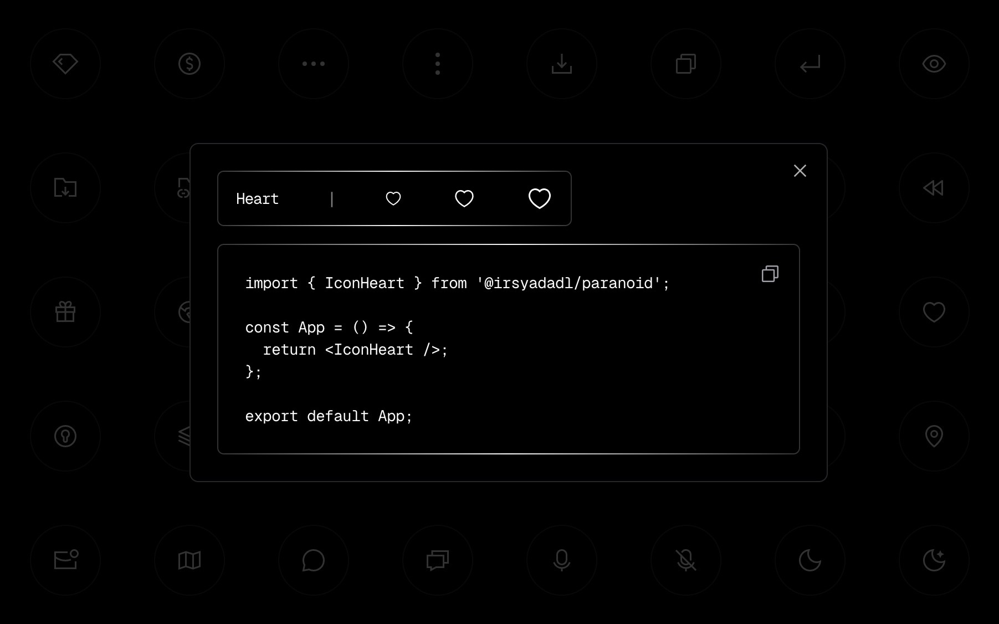

<br/>
<br/>

<p align="center">
  <a href="https://paranoid.irsyad.co">
    
  </a>
</p>
<h1 align="center">Paranoid</h1>

<div align="center">

A library of beautifully crafted react icons,
perfect for enhancing the visual appeal and user
experience of your web applications.
cooked by [irsyadadl](https://parsinta.com/@irsyadadl).

</div>

<p align="center">
  <a href="https://paranoid.irsyad.co">Explore icons</a>
</p>

<div align="center">

[](https://opensource.org/licenses/MIT)

</div>

[]()

## Install

You can install this package using any package manager, this example is using npm:

```bash
npm i @irsyadadl/paranoid
```

Or using bun:

```bash
bun i @irsyadadl/paranoid
```

## Usage

Elevating simplicity to elegance, effortlessly import your desired icon and wield it as a component. Unsure of your choice? Discover the perfect icon right [here](https://paranoid.irsyad.co).

```jsx
import { IconBag } from "@irsyadadl/paranoid";

const App = () => {
  return <IconBag />;
};

export default App;
```

## Find Icon

[Here](https://paranoid.irsyad.co)

## License

This library is [MIT](https://github.com/irsyadadl/paranoid/blob/master/LICENSE) licensed.

## Author

[irsyadadl](https://x.com/irsyadadl)
